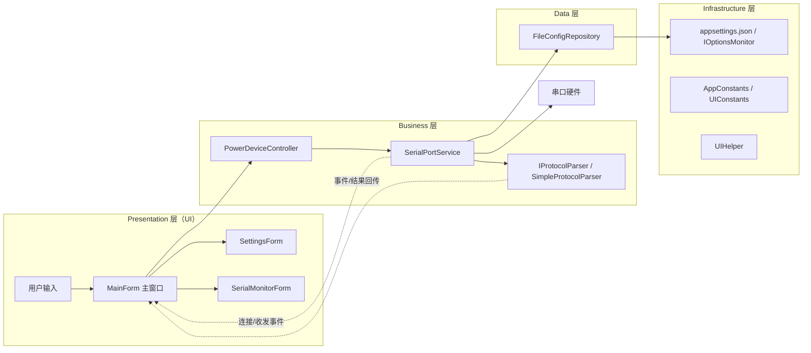

# Test Tool

这是一个基于 WinForms 的串口工具，用于控制电源设备并显示串口收发日志。项目使用 .NET 8 和 C# 12，采用分层设计（Presentation / Business / Data / Infrastructure），并通过 Microsoft.Extensions.Hosting + DI 管理应用生命周期与服务依赖。

快速开始

- 通过 Visual Studio 打开解决方案并运行 `Test Tool` 项目。
- 或使用命令行（在项目目录）：
  - `dotnet build`
  - `dotnet run --project "Test Tool"`

主要功能

- 串口连接/断开（异步）
- 串口数据收发与监视窗口
- 设备 ON/OFF 控制与状态显示
- 配置持久化（文件）与 `appsettings.json` 运行时绑定

依赖注入与服务生命周期（中文说明）

项目使用 `Microsoft.Extensions.DependencyInjection`，在 `Program.cs` 中通过 HostBuilder 注册服务。主要注册及理由：

- `ISerialPortService` -> `SerialPortService`（Singleton 单例）
  - 串口代表物理资源，应在应用中唯一共享，单例便于集中管理连接与事件。

- `IDeviceController` -> `PowerDeviceController`（Singleton 单例）
  - 设备状态需全局一致，且依赖串口服务，故使用单例。

- `IConfigRepository` -> `FileConfigRepository`（Singleton 单例）
  - 配置缓存与磁盘访问集中管理，单例避免并发写冲突。

- `MainForm`：主窗口，作为 Singleton（Host 托管）。
  - 负责 UI 响应，通过 `IMainFormCoordinator` 与业务层交互，不直接处理业务逻辑。
  - 采用无模式（Modeless）方式复用 `SettingsForm` 实例，支持主窗体拖动/缩放。

- `SettingsForm` / `SerialMonitorForm`：Transient（瞬态）。
  - `SettingsForm`：提供串口参数配置与锁定功能，支持即时保存（SettingsConfirmed 事件）。
  - `SerialMonitorForm`：独立窗口显示串口收发日志。

实践建议

- 单例服务必须线程安全并实现 IDisposable（Host 会在停止时释放单例）。
- 对话窗体如需使用 DI，可通过容器解析（AddTransient）或使用 `ActivatorUtilities.CreateInstance` 创建。
- 若需动态响应 `appsettings.json` 的更改，可使用 `IOptionsMonitor<T>`。

配置与重试策略

- `appsettings.json` 中的键：
  - `AppConfig:RetryPolicy:ConnectRetries`（默认 3）
  - `AppConfig:RetryPolicy:SendRetries`（默认 2）
  - `AppConfig:RetryPolicy:BaseDelayMs`（默认 200，指数退避基准毫秒）
- 策略热更新：`appsettings.json` 变更后通过 `IOptionsMonitor.OnChange` 重建重试策略（有防抖和异常计数日志）。
- API 取消支持：`ISerialPortService.ConnectAsync/DisconnectAsync/SendCommandAsync` 现支持可选 `CancellationToken`（调用方可传入超时/取消）。

文件清单与作用

- 根目录
  - `Program.cs`：应用入口，配置 Host、DI、主窗体启动。
  - `appsettings.json`：运行时配置（串口默认参数、重试策略等）。
  - `项目说明.md` / `架构设计.md` / `开发者指南.md` / `贡献指南.md`：文档与指南。
- Presentation（WinForms）
  - `MainForm.cs` / `MainForm.Designer.cs` / `MainForm.resx`：主窗口逻辑与界面资源
  - `SettingsForm.cs` / `SettingsForm.Designer.cs`：串口选择、锁定及监视器开关对话框
  - `SerialMonitorForm.cs`：串口收发日志子窗口，彩色显示
- Business
  - `Business/Enums/DeviceEnums.cs`：设备电源、连接状态等枚举定义。
  - `Business/Models/DeviceModels.cs`：设备状态、配置模型（AppConfig、ConnectionConfig 等）。
  - `Business/Models/ProtocolModels.cs`：协议帧模型。
  - `Business/Services/ISerialPortAdapter.cs` / `DefaultSerialPortAdapter.cs`：串口适配器抽象及默认实现。
  - `Business/Services/SerialPortService.cs`：串口服务实现（连接、发送、接收、重试策略、事件）。
  - `Business/Services/IDeviceServices.cs`：设备控制接口定义。
  - `Business/Services/PowerDeviceController.cs`：设备电源控制实现（调用串口服务发送开关命令）。
  - `Business/Services/IProtocolParser.cs` / `SimpleProtocolParser.cs`：串口协议解析接口与简单实现。
- Data
  - `Data/ConfigRepository.cs`：文件型配置仓库，实现配置的加载/保存。
- Infrastructure
  - `Infrastructure/Constants/AppConstants.cs`：默认配置、命令字符串、配置文件名等常量。
  - `Infrastructure/Constants/UIConstants.cs`：UI 颜色与尺寸常量。
  - `Infrastructure/Helpers/UIHelper.cs`：常用 UI 样式与状态更新辅助。
- Benchmarks（BenchmarkSuite1 项目）
  - `BenchmarkSuite1/Program.cs`：Benchmark 入口。
  - `BenchmarkSuite1/SerialPortServiceSendCommandBenchmark.cs`：`SendCommandAsync` 相关基准测试。
- Tests（测试项目）
  - 测试项目文件：测试项目 csproj（目录保留旧名，见解决方案）
  - 串口服务单元测试：`SerialPortServiceTests.cs`
  - 设备控制器单元测试：`PowerDeviceControllerTests.cs`
  - 配置仓库单元测试：`FileConfigRepositoryTests.cs`

程序架构（概要）

- 分层与依赖：Presentation（WinForms UI）→ Business（串口/设备逻辑、协议解析）→ Data（配置持久化）→ Infrastructure（常量、UI 辅助）；上层依赖下层抽象，业务通过接口解耦。
- 关键组件
  - `ISerialPortService`/`SerialPortService`：管理串口连接、收发、重试与事件分发。
  - `IDeviceController`/`PowerDeviceController`：封装电源开关命令并同步设备状态。
  - `IConfigRepository`/`FileConfigRepository`：配置加载/保存，提供默认值与缓存。
  - `IProtocolParser`/`SimpleProtocolParser`：解析串口帧，协议可插拔。
- 生命周期（HostBuilder 注册）
  - 单例：`SerialPortService`、`PowerDeviceController`、`FileConfigRepository`、`MainForm`。
  - 瞬态：`SettingsForm`、`SerialMonitorForm`（对话框每次新建，避免残留状态）。
- 数据流：用户操作 → `MainForm` → `PowerDeviceController` → `SerialPortService` → 串口硬件；事件反向驱动 UI（连接状态、数据收发、设备状态）。
- UI 状态：`UIHelper` 统一样式；`SerialMonitorForm` 彩色显示收发日志；`SettingsForm` 管理串口选择与锁定。
- 配置与重试：`appsettings.json` + `IOptionsMonitor` 热重载重试策略（连接/发送次数与延迟）；`FileConfigRepository` 持久化用户选择。

文档与扩展

更多架构细节、重构计划请参见 `架构设计.md`。如果需要我可以将架构设计中的内容拆成更短的开发者指南或贡献说明（中文）。
